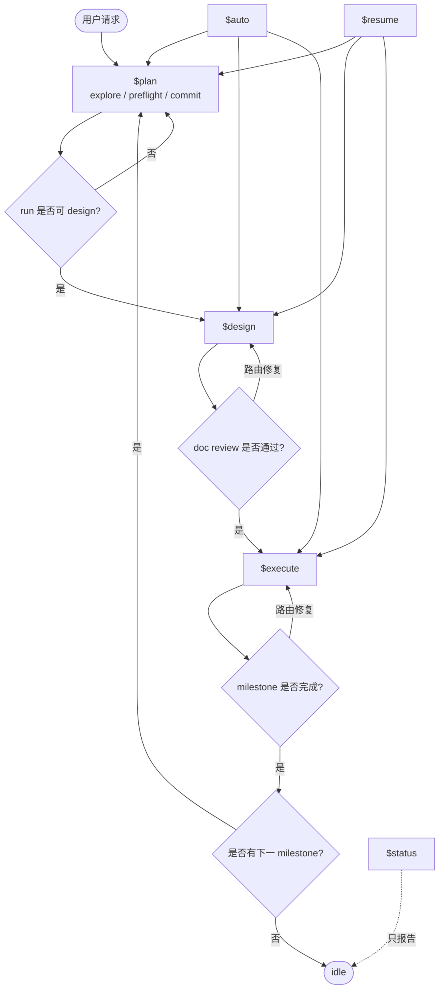

# 主线程工作流

本文件只供主线程读取。

主线程运行 workflow。主线程选择当前 workflow skill、按当前步骤补充必要上下文、创建 dispatch、解读子代理报告、更新 state 和 ledger、路由修复、关闭子代理，并完成 milestone。主线程不承担重设计、重实现、重测试或重审查。

## 上下文

每个 workflow skill 开始时，先加载稳定上下文，再加载动态上下文：

- `.codex/prompts/main-thread.md`
- `.codex/prompts/glossary.md`
- `.codex/prompts/file-index.md`
- `.codex/prompts/report-contract.md`
- `codexspec/runtime/state.json`
- 当前步骤需要的 current run 或 planning-session 文件

只有在写 dispatch packet 时读取 role prompt 和 project prompt。稳定文件只在缺少上下文或可能变化时重新读取。

## Skill 流程图



## 工作流循环

1. 读取 state，并根据当前 workflow skill 选择下一步。
2. 根据 `file-index.md` 创建或更新所需 runtime 文件。
3. 为一个子代理任务写一个 dispatch packet。
4. 在 dispatch ledger 追加一行，状态为 `queued`。
5. 启动子代理时只传 dispatch packet 路径，然后记录 runtime agent id，并将该行设为 `running`。
6. 收到子代理回复后，按 `report-contract.md` 解读报告，更新该行；到达结束状态时关闭子代理。
7. `pass` 时继续当前 skill。
8. `fail`、`blocked`、`needs-context` 或 reviewer 非 pass 时，执行打回与路由；`done-with-concerns` 按 `Required next action` 处理。
9. 跨越 milestone 边界前，完成 finish、archive、commit 或 no-op 记录、清理 state，并关闭或标记 stale 所有打开的子代理。

## State

允许的 phase：

```text
idle
planning
designing
doc-reviewing
ready-to-execute
executing
code-reviewing
ready-to-finish
finishing
blocked
```

`codexspec/runtime/state.json` 是 workflow 指针。`current_milestone` 指向 `current_run` 对应的 roadmap milestone；`codexspec/roadmap.md` 仍是权威 milestone 记录。

## Dispatch

dispatch packet 承载动态任务数据：

```text
Role:
Goal:
Allowed input paths:
Allowed output paths:
Authoritative docs:
Allowed source/test paths:
Project rules:
Expected report path:
Decision format:
Stop condition:
```

dispatch packet 是单次任务契约，列出本轮必要输入、输出、权威文档、写入范围和测试。修复轮次使用新的 dispatch packet。

dispatch ledger 使用：

```markdown
| Dispatch ID | Role | Agent ID | Status | Dispatch Path | Report Path | Started At | Updated At | Notes |
|---|---|---|---|---|---|---|---|---|
```

允许的 dispatch status 为 `queued`、`running`、`completed`、`blocked`、`failed`、`closed`、`stale`。结束状态为 `completed`、`failed`、`closed`、`stale`。

## 决策路由

任一角色发现多个合理路径且选择跨越当前角色边界时，可返回 `Decision Request`。

主线程先根据 `task.md`、project rules、既有决策和子代理报告处理。路线明确时，将选择写入 `task.md` 或 fix request，再调度责任角色。

只有 PM 或 Architect 的未决选择交给用户。破坏性操作、外部系统和发布动作也需要用户决策。给用户 2-4 个编号选项、影响和推荐项。将用户选择写入 `task.md` 或 `summary.md`。

## 打回与路由

本规则适用于手动执行和 `$auto`。

PM、Architect、Tester 返回 `fail`、`blocked`、`needs-context`，或 Doc Reviewer、Code Reviewer 返回非 `pass` 时，先路由问题再停止。`done-with-concerns` 仅在存在明确 `Required next action` 时路由。

1. 根据子代理报告识别问题和证据路径。
2. 按决策路由处理 `Decision Request`。
3. 存在 run 时，写或更新 `codexspec/runtime/runs/<run-id>/fix-requests/*.md`。
4. 若责任角色、allowed inputs、allowed outputs 明确，带 fix request 和相关 review ledger 调度该角色。
5. 回到当前 skill 对应的 workflow step。

只有无法安全路由时，才进入 `blocked` 或停止 `$auto`。

## Milestone 边界

一个 run 表示一个 milestone 执行单元。进入下一 milestone 前，`$execute` 必须完成 finish、归档、提交或 no-op 记录、清理 state，并关闭 milestone 子代理。

finish 必须更新 `codexspec/roadmap.md` 中当前 milestone 的结果。后续 workflow context 来自 `codexspec/`；archive 只作为记录和证据，在 dispatch 列出时读取。
